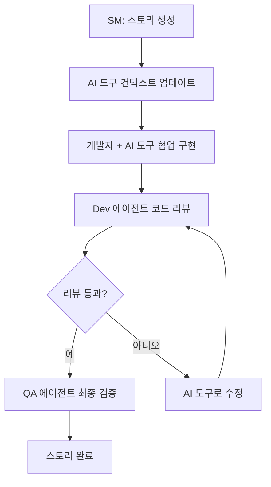

# BMAD-METHOD™ 사용 방법 완전 가이드

## 📋 목차

1. [프로젝트 개요](#-프로젝트-개요)
2. [설치 및 설정](#-설치-및-설정)
3. [기본 사용법](#-기본-사용법)
4. [워크플로우](#-워크플로우)
5. [에이전트 시스템](#-에이전트-시스템)
6. [확장팩 시스템](#-확장팩-시스템)
7. [CLI 명령어](#-cli-명령어)
8. [문제 해결](#-문제-해결)
9. [고급 사용법](#-고급-사용법)

## 🎯 프로젝트 개요

BMAD-METHOD™는 AI 에이전트를 활용한 소프트웨어 개발 방법론으로, 다음 두 가지 핵심 혁신을 제공합니다:

### 1. 에이전틱 기획 (Agentic Planning)

- 전담 에이전트들(Analyst, PM, Architect)이 협업하여 상세한 PRD 및 아키텍처 문서 생성
- 고급 프롬프트 엔지니어링과 휴먼-인-더-루프 개선을 통한 포괄적인 명세서 작성

### 2. 컨텍스트 엔지니어링 개발 (Context-Engineered Development)

- Scrum Master 에이전트가 상세 계획을 초상세 개발 스토리로 변환
- 전체 컨텍스트, 구현 세부사항, 아키텍처 가이드라인을 스토리 파일에 직접 포함

이 접근 방식은 **계획 불일치**와 **컨텍스트 손실** - AI 지원 개발의 가장 큰 문제들을 해결합니다.

## 🔧 설치 및 설정

### 시스템 요구사항

- **Node.js**: v20 이상 필요
- **운영체제**: Windows, macOS, Linux 지원
- **권장 IDE**: VSCode, Cursor, 또는 기타 Markdown 지원 편집기

### 빠른 설치

#### 방법 1: NPX를 통한 자동 설치 (권장)

```bash
# 새 설치 또는 자동 업데이트
npx bmad-method install

# 또는 명시적으로 stable 태그 사용
npx bmad-method@stable install
```

#### 방법 2: 기존 프로젝트에서 업데이트

```bash
git pull
npm run install:bmad
```

### 설치 유형

#### 1. 전체 설치 (Full Installation)

```bash
npx bmad-method install --full
```

- 모든 에이전트와 워크플로우 포함
- 완전한 .bmad-core 폴더 설치

#### 2. 단일 에이전트 설치

```bash
npx bmad-method install --agent=pm
```

- 특정 에이전트만 설치
- 의존성 자동 해결

#### 3. 팀 설치

```bash
npx bmad-method install --team=fullstack
```

- 사전 정의된 팀 구성으로 설치

#### 4. 확장팩 포함 설치

```bash
npx bmad-method install --full --expansion-packs creative-writing,game-dev
```

### IDE 통합 설정

#### Cursor 설정

```bash
npx bmad-method install --ide=cursor
```

#### GitHub Copilot 설정

```bash
npx bmad-method install --ide=github-copilot
```

## 🚀 기본 사용법

### 웹 UI로 시작하기 (가장 빠른 방법)

1. **팀 파일 다운로드**
   ```bash
   # 빌드하여 웹 번들 생성
   npm run build
   ```
2. **AI 플랫폼에서 에이전트 생성**
   - `dist/teams/team-fullstack.txt` 파일을 Gemini, ChatGPT에 업로드
   - 지침 설정: "중요한 운영 지침이 첨부되었습니다. 지시된 대로 캐릭터를 깨지 마세요"

3. **작업 시작**
   ```
   *help  # 사용 가능한 명령어 보기
   *analyst  # 프로젝트 브리프 작성 시작
   ```

### IDE에서 시작하기

1. **BMad Master 에이전트 활성화**

   ```bash
   # 설치 후 .bmad-core/agents/bmad-master.md를 IDE에서 열기
   ```

2. **기본 명령어**
   ```
   *help     # 도움말 보기
   *create   # 새 스토리 생성
   *kb       # 지식베이스 접근
   ```

## 📋 워크플로우

### 1단계: 기획 워크플로우 (웹 UI 권장)

```
아이디어 → Analyst(선택) → PM(PRD 작성) → UX Expert(선택) → Architect(아키텍처) → PO(검증)
```

#### 주요 과정:

1. **Analyst**: 시장 조사, 경쟁 분석, 프로젝트 브리프 작성
2. **PM**: PRD(Product Requirements Document) 생성
3. **UX Expert**: 프론트엔드 명세 및 UI 설계 (선택)
4. **Architect**: 기술 아키텍처 설계 및 문서화
5. **PO**: 문서 검증 및 승인

#### 결과물:

- `docs/prd.md`: 제품 요구사항 문서
- `docs/architecture.md`: 기술 아키텍처 문서
- `docs/front-end-spec.md`: UI/UX 명세 (선택)

### 2단계: 개발 워크플로우 (IDE)

```bash
PO(문서 샤딩) → SM(스토리 생성) → Dev(구현) → QA(테스트) → SM(다음 스토리)
```

#### 주요 과정:

1. **PO**: 문서를 에픽별로 샤딩
2. **SM**: 개발 스토리 생성 (Draft 상태)
3. **Dev**: 스토리 구현 (Review 상태로 변경)
4. **QA**: 코드 리뷰 및 테스트 (Done 상태로 변경)
5. 다음 스토리로 반복

#### 스토리 상태 순환:

- **Draft** → **Approved** → **Review** → **Done**

### 브라운필드(기존 프로젝트) 워크플로우

```bash
# 프로젝트 플래튼화
npx bmad-method flatten

# 브라운필드 전용 워크플로우 사용
# brownfield-fullstack.yaml 참조
```

## 🤖 에이전트 시스템

### 기획 단계 에이전트

#### Analyst (`analyst.md`)

- **역할**: 시장 조사, 경쟁 분석, 프로젝트 브리프 작성
- **주요 기능**: 브레인스토밍, 시장 조사, 경쟁사 분석
- **출력**: project-brief.md

#### PM (`pm.md`)

- **역할**: 요구사항 분석, PRD 작성
- **주요 기능**: 기능 요구사항, 비기능 요구사항, 에픽, 스토리 정의
- **출력**: prd.md

#### Architect (`architect.md`)

- **역할**: 기술 아키텍처 설계 및 문서화
- **주요 기능**: 시스템 아키텍처, 기술 스택, 데이터 모델 설계
- **출력**: architecture.md

#### UX Expert (`ux-expert.md`)

- **역할**: 프론트엔드 사양 및 UI 설계
- **주요 기능**: UI/UX 명세, 사용자 경험 설계
- **출력**: front-end-spec.md

### 개발 단계 에이전트

#### PO (`po.md`)

- **역할**: Product Owner, 문서 검증 및 스토리 관리
- **주요 기능**: 문서 샤딩, 품질 검증, 스토리 승인
- **출력**: 샤딩된 문서들

#### SM (`sm.md`)

- **역할**: Scrum Master, 개발 스토리 생성 및 관리
- **주요 기능**: 스토리 생성, 개발 계획, 진행 상황 추적
- **출력**: 개발 스토리 파일들

#### Dev (`dev.md`)

- **역할**: 개발자, 실제 코드 구현
- **주요 기능**: 코드 작성, 기능 구현, 단위 테스트
- **출력**: 구현된 코드

#### QA (`qa.md`)

- **역할**: 품질 보증, 테스트 전략 및 실행
- **주요 기능**: 코드 리뷰, 테스트 실행, 품질 검증
- **출력**: 테스트 결과, 품질 보고서

### 통합 에이전트

#### BMad Master (`bmad-master.md`)

- **역할**: 모든 도메인의 종합 전문가
- **주요 기능**: 범용 작업 실행, 모든 리소스 직접 실행
- **사용 시기**: 페르소나가 필요하지 않은 일회성 작업

#### BMad Orchestrator (`bmad-orchestrator.md`)

- **역할**: 전체 워크플로우 조율
- **주요 기능**: 워크플로우 관리, 에이전트 간 조율
- **사용 시기**: 복잡한 다단계 프로세스

### 에이전트 활성화 방식

모든 에이전트는 완전한 YAML 블록을 포함하며 다음과 같이 활성화됩니다:

1. **활성화 과정**: 전체 에이전트 파일 읽기 → 페르소나 채택 → core-config.yaml 로드 → 사용자에게 인사 및 `*help` 자동 실행
2. **의존성 로드**: 사용자가 명령 요청 시에만 필요한 작업/템플릿 파일 로드
3. **캐릭터 유지**: 각 에이전트는 고유한 페르소나와 전문 영역 유지

### 주요 명령어 시스템

모든 에이전트 명령어는 `*` 접두사를 사용합니다:

- `*help`: 사용 가능한 명령어 표시
- `*create`: 새로운 작업 생성
- `*kb`: 지식베이스 접근
- `*validate`: 검증 실행

## 🧩 확장팩 시스템

BMAD-METHOD™는 소프트웨어 개발을 넘어 다양한 도메인으로 확장 가능합니다.

### 사용 가능한 확장팩

#### 게임 개발

- **2D Phaser 게임 개발**: `bmad-2d-phaser-game-dev`
- **Unity 2D 게임 개발**: `bmad-2d-unity-game-dev`

#### 창작 및 비즈니스

- **창의적 글쓰기**: `bmad-creative-writing`
- **인프라 관리**: `bmad-infrastructure-devops`

### 확장팩 설치

```bash
# 단일 확장팩 설치
npx bmad-method install --full --expansion-packs creative-writing

# 여러 확장팩 설치
npx bmad-method install --full --expansion-packs creative-writing,game-dev

# 확장팩만 설치
npx bmad-method install --expansion-only --expansion-packs creative-writing
```

### 확장팩 구조

각 확장팩은 독립적인 구조를 가집니다:

```bash
.확장팩-이름/
├── agents/           # 도메인 특화 에이전트
├── tasks/            # 특화된 작업 워크플로우
├── templates/        # 문서 템플릿
├── checklists/       # 품질 검사 체크리스트
├── workflows/        # 표준 워크플로우
├── data/             # 지식베이스
└── config.yaml       # 확장팩 설정
```

## 🔨 CLI 명령어

### 설치 관련

```bash
# 기본 설치
npx bmad-method install

# 전체 설치
npx bmad-method install --full

# 특정 에이전트 설치
npx bmad-method install --agent=pm

# 팀 설치
npx bmad-method install --team=fullstack

# IDE 통합 포함 설치
npx bmad-method install --ide=cursor

# 확장팩 포함 설치
npx bmad-method install --expansion-packs game-dev
```

### 빌드 관련

```bash
# 전체 빌드 (웹용 에이전트 파일 생성)
npm run build

# 에이전트만 빌드
npm run build:agents

# 팀만 빌드
npm run build:teams

# 설정 검증
npm run validate

# 사용 가능한 에이전트 목록
npm run list:agents
```

### 개발 도구

```bash
# 포맷팅
npm run format
npm run format:check

# 린팅
npm run lint
npm run lint:fix

# 프로젝트 플래튼화 (브라운필드용)
npm run flatten
```

### 버전 관리

```bash
# 패치 버전 업데이트
npm run version:patch

# 마이너 버전 업데이트
npm run version:minor

# 메이저 버전 업데이트
npm run version:major

# 모든 확장팩 버전 동기화
npm run version:all
```

### 상태 확인

```bash
# 설치 상태 확인
npx bmad-method status

# 사용 가능한 에이전트 나열
npx bmad-method list:agents

# 확장팩 목록 보기
npx bmad-method list:expansion-packs
```

## 🔧 문제 해결

### 설치 문제

#### Node.js 버전 오류

```bash
# Node.js 버전 확인
node --version

# Node.js v20+ 설치 필요
# https://nodejs.org에서 최신 LTS 버전 다운로드
```

#### 권한 오류

```bash
# 관리자 권한으로 실행 (Windows)
# sudo 사용 (Linux/macOS)
sudo npx bmad-method install
```

#### 네트워크 문제

```bash
# NPM 캐시 정리
npm cache clean --force

# 다른 NPM 레지스트리 시도
npm install --registry https://registry.npmjs.org/
```

### 설정 문제

#### core-config.yaml 누락

```bash
# 수동으로 bmad-core/core-config.yaml을 프로젝트 루트에 복사
cp bmad-core/core-config.yaml ./
```

#### 에이전트 활성화 실패

1. **전체 파일 읽기**: 에이전트 파일을 완전히 읽었는지 확인
2. **YAML 블록**: YAML 구성이 올바르게 파싱되는지 확인
3. **의존성**: 필요한 작업/템플릿 파일이 있는지 확인

#### 스토리 생성 문제

1. **문서 샤딩**: PO 에이전트로 문서가 제대로 샤딩되었는지 확인
2. **에픽 순서**: 에픽이 올바른 순서로 배치되었는지 확인
3. **상태 관리**: 스토리 상태가 올바르게 업데이트되는지 확인

### 성능 문제

#### 느린 에이전트 응답

1. **모델 선택**: 더 빠른 AI 모델 사용
2. **컨텍스트 크기**: 불필요한 파일 제거
3. **병렬 처리**: 여러 에이전트를 동시에 실행하지 않기

#### 메모리 부족

1. **파일 크기**: 대용량 파일 분할
2. **브라우저**: 웹 UI 사용 시 브라우저 메모리 확인
3. **플래튼화**: 불필요한 파일 제외

## 🔗 AI 코딩 도구 연동

BMAD-METHOD™는 다양한 AI 코딩 도구와 함께 사용하여 개발 효율성을 극대화할 수 있습니다.

### Claude Code 연동

#### 1. 기본 연동 방법

**단계 1: CLAUDE.md 파일 활용**

```bash
# 이미 프로젝트에 CLAUDE.md가 있어 BMAD 프로젝트 정보 포함
# Claude Code가 자동으로 프로젝트 구조와 사용법을 이해
```

**단계 2: 개발 워크플로우와 연동**

```
1. SM 에이전트로 스토리 생성
2. 생성된 스토리 파일을 Claude Code와 공유
3. Claude Code가 스토리의 상세 컨텍스트를 기반으로 구현
4. Dev 에이전트와 협업하여 코드 리뷰 및 개선
```

#### 2. 실제 사용 시나리오

**시나리오 A: 새 기능 개발**

```markdown
1. SM: "사용자 인증 기능을 위한 스토리 생성"
   → docs/stories/1.2.user-auth.story.md 생성

2. Claude Code에게 요청:
   "docs/stories/1.2.user-auth.story.md 파일을 읽고
   이 스토리에 기술된 사용자 인증 기능을 구현해주세요."

3. Claude Code가 스토리의 전체 컨텍스트를 이해하고 구현:
   - 아키텍처 가이드라인 준수
   - 기술 스택 요구사항 반영
   - 상세 구현 사항 포함
```

**시나리오 B: 코드 리뷰 및 개선**

```markdown
1. Dev 에이전트로 초기 구현 완료
2. Claude Code에게 리뷰 요청:
   "이 코드를 architecture.md의 가이드라인에 맞게
   리뷰하고 개선점을 제안해주세요."
3. QA 에이전트와 Claude Code 협업으로 최종 검증
```

#### 3. Claude Code 최적화 팁

**효과적인 프롬프트 작성**

```markdown
# 좋은 예

"docs/architecture.md와 docs/stories/현재스토리.md를 참고하여
인증 미들웨어를 구현해주세요.
보안 요구사항과 성능 기준을 모두 만족해야 합니다."

# 피해야 할 예

"로그인 기능 만들어줘"
```

**컨텍스트 관리**

```markdown
- 항상 관련 스토리 파일을 먼저 참조하도록 안내
- 아키텍처 문서의 해당 섹션 명시
- 기존 코드와의 일관성 유지 요청
```

### GitHub Copilot 연동

#### 1. Copilot 설정 및 연동

**설치 시 Copilot 규칙 설정**

```bash
npx bmad-method install --ide=github-copilot
```

이 명령어는 다음을 자동으로 설정합니다:

- `.github/copilot-instructions.md` 파일 생성
- BMAD 프로젝트 구조와 에이전트 역할 설명
- 아키텍처 가이드라인 포함

#### 2. Copilot 지침 파일 구조

```markdown
# GitHub Copilot Instructions for BMAD Project

## Project Context

- BMAD-METHOD™ 프로젝트
- 에이전트 기반 애자일 개발 방법론
- 아키텍처: [architecture.md 요약]

## Code Style Guidelines

- [coding-standards.md 내용]
- TypeScript/JavaScript 컨벤션
- 테스팅 패턴

## Current Story Context

- 현재 작업 중인 스토리: [자동 업데이트]
- 구현 요구사항: [스토리 파일 내용]
```

#### 3. 개발 워크플로우 통합

**스토리 기반 개발**

```markdown
1. SM 에이전트가 스토리 생성
2. .github/copilot-instructions.md 자동 업데이트
3. Copilot이 스토리 컨텍스트를 이해하고 코드 제안
4. Dev 에이전트가 최종 검토
```

### Cursor 연동

#### 1. Cursor IDE 설정

**자동 설정**

```bash
npx bmad-method install --ide=cursor
```

**수동 설정**

```json
// .cursor/rules/bmad-rules.md
BMad Method 프로젝트입니다.

## 프로젝트 구조
- docs/: 기획 문서 (PRD, 아키텍처)
- docs/stories/: 개발 스토리
- .bmad-core/: 에이전트 및 워크플로우

## 개발 가이드라인
[아키텍처 문서 요약]
[코딩 표준]
```

#### 2. 커스텀 에이전트 모드

**Cursor 커스텀 에이전트 생성**

```markdown
1. Cursor > Settings > Features > Custom Agents
2. "BMAD Dev Agent" 생성
3. 시스템 프롬프트에 다음 추가:

"당신은 BMAD-METHOD 프로젝트의 개발 에이전트입니다.

- 항상 현재 스토리 파일의 컨텍스트를 우선 고려
- docs/architecture.md의 가이드라인 준수
- docs/stories/ 폴더의 현재 작업 중인 스토리 참조
- 코드 변경 시 스토리 상태를 'Review'로 업데이트"
```

### 기타 AI 코딩 도구 연동

#### CodeGPT 연동

```markdown
1. 프로젝트 컨텍스트 파일 생성:
   - .codegpt/context.md
   - BMAD 프로젝트 구조 및 현재 스토리 포함

2. 커스텀 에이전트 생성:
   - BMAD Dev Assistant
   - BMAD Story Reviewer
```

#### Tabnine 연동

```json
// .tabnine/tabnine_config.json
{
  "context_files": ["docs/architecture.md", "docs/stories/**/*.md", ".bmad-core/data/bmad-kb.md"],
  "project_type": "bmad-method"
}
```

### 통합 개발 워크플로우

#### 최적화된 개발 사이클



#### 실제 작업 흐름

**1. 스토리 시작**

```bash
# SM 에이전트로 새 스토리 생성
@sm
*create

# 생성된 스토리: docs/stories/2.3.payment-integration.story.md
```

**2. AI 도구 준비**

```markdown
# Claude Code에게

"방금 생성된 docs/stories/2.3.payment-integration.story.md
파일을 읽어보고, 이 스토리의 요구사항을 이해했다고
확인해주세요."

# Cursor 사용자

- 스토리 파일 열기
- Cmd+K로 코드 생성 시작
- "현재 스토리 요구사항에 맞는 결제 통합 기능 구현"
```

**3. 협업 개발**

```markdown
개발자: 기본 구조 설계
AI 도구: 세부 구현 및 테스트 코드 생성  
Dev 에이전트: 아키텍처 준수 및 코드 품질 검토
QA 에이전트: 테스트 시나리오 검증
```

#### 품질 관리 체크리스트

**AI 도구 사용 시 확인 사항**

- [ ] 현재 스토리 파일을 정확히 참조했는가?
- [ ] 아키텍처 가이드라인을 준수했는가?
- [ ] 기존 코드와 일관성을 유지했는가?
- [ ] 적절한 테스트 코드가 포함되었는가?
- [ ] 스토리 상태가 올바르게 업데이트되었는가?

### 성능 및 효율성 팁

#### 컨텍스트 최적화

```markdown
1. 관련 파일만 AI 도구에 제공
   - 현재 스토리 파일
   - 해당 아키텍처 섹션
   - 관련 기존 코드

2. 단계적 구현
   - 큰 스토리를 작은 단위로 분할
   - AI 도구로 단계별 구현
   - 각 단계마다 Dev/QA 에이전트 검토
```

#### 비용 효율성

```markdown
1. 기본 구현: GitHub Copilot (실시간)
2. 복잡한 로직: Claude Code (요청 기반)
3. 리팩토링: Cursor (IDE 통합)
4. 최종 검토: BMAD 에이전트들
```

### OpenAI Codex 연동

#### 1. Codex API 설정

**환경 변수 설정**

```bash
# .env 파일에 추가
OPENAI_API_KEY=your_api_key_here
BMAD_CODEX_MODEL=code-davinci-002
```

**VS Code 확장 프로그램 설정**

```json
// settings.json
{
  "openai.apiKey": "${OPENAI_API_KEY}",
  "openai.context": {
    "includeBmadStory": true,
    "includeArchitecture": true,
    "maxContextFiles": 5
  }
}
```

#### 2. Codex와 BMAD 워크플로우 통합

**스토리 기반 코드 생성**

```python
# codex_bmad_integration.py
import openai
import os

def generate_code_from_story(story_file_path, architecture_context):
    """
    BMAD 스토리 파일을 기반으로 Codex를 사용하여 코드 생성
    """
    with open(story_file_path, 'r', encoding='utf-8') as f:
        story_content = f.read()

    prompt = f"""
    # BMAD 프로젝트 - 코드 생성 요청

    ## 아키텍처 컨텍스트:
    {architecture_context}

    ## 현재 스토리:
    {story_content}

    ## 요청:
    위 스토리의 요구사항에 맞는 코드를 생성해주세요.
    아키텍처 가이드라인을 준수하고 테스트 코드도 포함해주세요.

    """

    response = openai.Completion.create(
        engine="code-davinci-002",
        prompt=prompt,
        max_tokens=2000,
        temperature=0.2
    )

    return response.choices[0].text
```

#### 3. 자동화된 Codex 워크플로우

**VS Code 태스크 설정**

```json
// .vscode/tasks.json
{
  "version": "2.0.0",
  "tasks": [
    {
      "label": "BMAD: Generate Code from Story",
      "type": "shell",
      "command": "python",
      "args": [
        "${workspaceFolder}/scripts/codex_generator.py",
        "--story=${input:storyFile}",
        "--architecture=${workspaceFolder}/docs/architecture.md"
      ],
      "group": "build",
      "presentation": {
        "echo": true,
        "reveal": "always",
        "focus": false,
        "panel": "shared"
      }
    }
  ],
  "inputs": [
    {
      "id": "storyFile",
      "description": "스토리 파일 경로",
      "type": "promptString",
      "default": "docs/stories/"
    }
  ]
}
```

### JetBrains AI 연동 (IntelliJ IDEA, PyCharm 등)

#### 1. JetBrains AI Assistant 설정

**플러그인 설치 및 설정**

```xml
<!-- .idea/bmad-context.xml -->
<component name="BmadContextProvider">
  <option name="storyDirectory" value="docs/stories" />
  <option name="architectureFile" value="docs/architecture.md" />
  <option name="autoLoadContext" value="true" />
</component>
```

**라이브 템플릿 설정**

```
// bmad-story-impl
// 스토리 기반 구현 템플릿

// 현재 스토리: $STORY_FILE$
// 아키텍처: $ARCH_SECTION$
// 구현 요구사항:
$IMPLEMENTATION_DETAILS$

$END$
```

#### 2. 커스텀 액션 생성

```kotlin
// BmadStoryImplementAction.kt
class BmadStoryImplementAction : AnAction() {
    override fun actionPerformed(e: AnActionEvent) {
        val project = e.project ?: return
        val storyFile = selectStoryFile(project)
        val architectureContent = loadArchitecture(project)

        // AI Assistant에 컨텍스트 제공
        AIAssistantService.getInstance(project).setContext(
            "BMAD Story: ${storyFile.content}\n" +
            "Architecture: $architectureContent"
        )
    }
}
```

### Replit Ghostwriter 연동

#### 1. Replit 환경에서 BMAD 설정

**replit.nix 설정**

```nix
{ pkgs }: {
  deps = [
    pkgs.nodejs-18_x
    pkgs.python3
  ];

  env = {
    BMAD_MODE = "replit";
    GHOSTWRITER_CONTEXT = "bmad-stories";
  };
}
```

**Ghostwriter 컨텍스트 파일**

```markdown
<!-- .replit/ghostwriter-context.md -->

# BMAD-METHOD 프로젝트

## 현재 컨텍스트

- 프로젝트 유형: BMAD 에이전트 기반 개발
- 현재 스토리: [자동 업데이트됨]
- 아키텍처 가이드라인: [architecture.md 내용]

## 코딩 규칙

- 모든 구현은 현재 스토리 요구사항을 따름
- 아키텍처 문서의 기술 스택 사용
- 테스트 우선 개발(TDD) 적용
```

#### 2. 스토리 연동 스크립트

```python
# update_ghostwriter_context.py
import os
import glob

def update_ghostwriter_context():
    """현재 작업 중인 스토리로 Ghostwriter 컨텍스트 업데이트"""

    # 최신 스토리 파일 찾기
    story_files = glob.glob("docs/stories/*.story.md")
    latest_story = max(story_files, key=os.path.getctime)

    with open(latest_story, 'r') as f:
        story_content = f.read()

    # Ghostwriter 컨텍스트 업데이트
    context_template = f"""
# BMAD 개발 컨텍스트

## 현재 스토리
{story_content}

## 구현 가이드
- 스토리의 acceptance criteria 모두 충족
- architecture.md의 기술 스택 사용
- 테스트 코드 포함 필수
"""

    with open('.replit/ghostwriter-context.md', 'w') as f:
        f.write(context_template)

if __name__ == "__main__":
    update_ghostwriter_context()
```

### Amazon CodeWhisperer 연동

#### 1. CodeWhisperer 설정

**AWS Toolkit 설정**

```json
// .vscode/settings.json
{
  "aws.codeWhisperer.shareCodeWhispererContentWithAWS": false,
  "aws.codeWhisperer.includeBmadContext": true,
  "aws.codeWhisperer.contextFiles": [
    "docs/architecture.md",
    "docs/stories/**/*.story.md",
    ".bmad-core/data/bmad-kb.md"
  ]
}
```

#### 2. 커스텀 컨텍스트 제공자

```python
# codewhisperer_context.py
import json
import os
from typing import List, Dict

class BmadContextProvider:
    def __init__(self, project_root: str):
        self.project_root = project_root

    def get_current_context(self) -> Dict:
        """현재 BMAD 컨텍스트 반환"""
        return {
            "projectType": "bmad-method",
            "currentStory": self._get_current_story(),
            "architecture": self._get_architecture_summary(),
            "codeStyle": self._get_coding_standards()
        }

    def _get_current_story(self) -> str:
        """현재 작업 중인 스토리 내용 반환"""
        stories_dir = os.path.join(self.project_root, "docs/stories")
        if not os.path.exists(stories_dir):
            return ""

        # 최신 스토리 파일 찾기
        story_files = [f for f in os.listdir(stories_dir)
                      if f.endswith('.story.md')]

        if not story_files:
            return ""

        latest_story = max(story_files,
                          key=lambda f: os.path.getctime(
                              os.path.join(stories_dir, f)))

        with open(os.path.join(stories_dir, latest_story), 'r') as f:
            return f.read()
```

### 통합 AI 개발 환경 구성

#### 1. 멀티 AI 도구 설정

**설정 파일 통합**

```yaml
# .bmad/ai-tools-config.yaml
ai_tools:
  primary: 'claude-code' # 주 AI 도구
  secondary: 'github-copilot' # 보조 AI 도구

  claude_code:
    context_files:
      - 'docs/stories/**/*.md'
      - 'docs/architecture.md'
      - '.bmad-core/data/bmad-kb.md'

  github_copilot:
    instructions_file: '.github/copilot-instructions.md'
    auto_update: true

  cursor:
    rules_file: '.cursor/rules/bmad-rules.md'
    custom_agents: ['BMAD Dev Agent', 'BMAD Reviewer']

  codex:
    model: 'code-davinci-002'
    max_tokens: 2000
    temperature: 0.2
```

#### 2. 컨텍스트 동기화 스크립트

```bash
#!/bin/bash
# sync_ai_contexts.sh

echo "🔄 BMAD AI 컨텍스트 동기화 중..."

# 현재 스토리 확인
CURRENT_STORY=$(ls -t docs/stories/*.story.md 2>/dev/null | head -n 1)

if [ -z "$CURRENT_STORY" ]; then
    echo "❌ 활성 스토리를 찾을 수 없습니다."
    exit 1
fi

echo "📖 현재 스토리: $CURRENT_STORY"

# Claude Code CLAUDE.md 업데이트 (자동으로 처리됨)
echo "✅ Claude Code 컨텍스트 준비됨"

# GitHub Copilot 지침 업데이트
if [ -f ".github/copilot-instructions.md" ]; then
    echo "📝 Copilot 지침 업데이트 중..."
    python scripts/update_copilot_context.py "$CURRENT_STORY"
fi

# Cursor 규칙 업데이트
if [ -d ".cursor" ]; then
    echo "🖱️ Cursor 규칙 업데이트 중..."
    python scripts/update_cursor_context.py "$CURRENT_STORY"
fi

# Codex 컨텍스트 업데이트
if [ -f ".env" ] && grep -q "OPENAI_API_KEY" .env; then
    echo "🤖 Codex 컨텍스트 업데이트 중..."
    python scripts/update_codex_context.py "$CURRENT_STORY"
fi

echo "✅ 모든 AI 도구 컨텍스트 동기화 완료!"
```

#### 3. 개발 흐름 자동화

```python
# bmad_ai_workflow.py
"""
BMAD + AI 도구 통합 워크플로우 자동화
"""

import subprocess
import os
from pathlib import Path

class BmadAIWorkflow:
    def __init__(self, project_root: str):
        self.project_root = Path(project_root)

    def start_new_story(self, epic_num: int, story_num: int):
        """새 스토리 시작 및 AI 도구 컨텍스트 업데이트"""

        # 1. SM 에이전트로 스토리 생성
        print("📝 SM 에이전트로 새 스토리 생성 중...")
        # subprocess.run(["bmad-sm", "create", f"{epic_num}.{story_num}"])

        # 2. 모든 AI 도구 컨텍스트 동기화
        print("🔄 AI 도구 컨텍스트 동기화 중...")
        subprocess.run(["./scripts/sync_ai_contexts.sh"])

        # 3. 개발 환경 준비
        story_file = self.project_root / f"docs/stories/{epic_num}.{story_num}.story.md"
        if story_file.exists():
            print(f"✅ 스토리 생성 완료: {story_file}")
            print("💡 이제 AI 도구를 사용하여 개발을 시작할 수 있습니다!")

            # VS Code에서 스토리 파일 열기
            subprocess.run(["code", str(story_file)])
        else:
            print("❌ 스토리 파일 생성 실패")

    def complete_story(self, epic_num: int, story_num: int):
        """스토리 완료 및 상태 업데이트"""

        # 1. Dev 에이전트로 리뷰 상태로 변경
        print("🔍 Dev 에이전트 코드 리뷰 중...")

        # 2. QA 에이전트로 최종 검증
        print("✅ QA 에이전트 최종 검증 중...")

        # 3. 스토리 상태를 Done으로 업데이트
        story_file = self.project_root / f"docs/stories/{epic_num}.{story_num}.story.md"
        if story_file.exists():
            # 스토리 파일의 상태 업데이트 로직
            self._update_story_status(story_file, "Done")
            print(f"🎉 스토리 {epic_num}.{story_num} 완료!")

# 사용 예제
if __name__ == "__main__":
    workflow = BmadAIWorkflow(".")
    workflow.start_new_story(2, 3)  # Epic 2, Story 3 시작
```

이렇게 Claude Code, GitHub Copilot, Cursor, Codex, JetBrains AI 등 다양한 AI 코딩 도구와 BMAD-METHOD™를 연동하는 포괄적인 가이드를 추가했습니다. 각 도구별로 최적화된 설정 방법과 실제 사용 시나리오, 그리고 여러 도구를 함께 사용할 때의 워크플로우 자동화 방법까지 포함되어 있습니다.

## 🎓 고급 사용법

### 커스텀 에이전트 생성

1. **에이전트 파일 생성**

   ````markdown
   # My Custom Agent

   ```yaml
   agent:
     name: Custom Agent
     id: custom-agent
     title: 커스텀 에이전트
   persona:
     role: 특수 작업 전문가
     identity: 특정 도메인의 전문 에이전트
   ```
   ````

2. **의존성 정의**
   ```yaml
   dependencies:
     tasks:
       - custom-task
     templates:
       - custom-template
   ```

### 워크플로우 커스터마이징

1. **새 워크플로우 파일 생성**

   ```yaml
   workflow:
     id: custom-workflow
     name: 커스텀 워크플로우
     sequence:
       - agent: custom-agent
         creates: custom-output.md
   ```

2. **기존 워크플로우 수정**
   - `bmad-core/workflows/` 폴더에서 기존 워크플로우 복사
   - 필요에 따라 단계 수정

### 확장팩 개발

1. **확장팩 구조 생성**

   ```bash
   mkdir my-expansion-pack
   cd my-expansion-pack
   mkdir agents tasks templates checklists data workflows
   ```

2. **config.yaml 작성**

   ```yaml
   name: My Expansion Pack
   id: my-pack
   version: 1.0.0
   description: 커스텀 확장팩
   ```

3. **에이전트 및 리소스 추가**
   - 도메인별 에이전트 작성
   - 특화된 작업 워크플로우 정의
   - 템플릿 및 체크리스트 추가

### 대규모 프로젝트 관리

1. **문서 샤딩 전략**
   - 큰 PRD를 의미있는 에픽으로 분할
   - 아키텍처 문서를 모듈별로 구성

2. **팀 협업**
   - 각 팀원이 다른 에픽 담당
   - 스토리 상태 공유 및 추적

3. **품질 관리**
   - 정기적인 QA 게이트 실행
   - 코드 리뷰 체크리스트 활용

### 성능 최적화

1. **효율적인 에이전트 사용**
   - 적절한 에이전트 선택
   - 불필요한 의존성 제거

2. **문서 관리**
   - 적정 크기 유지
   - 정기적인 정리 및 업데이트

3. **캐싱 활용**
   - 반복 작업 결과 재사용
   - 템플릿 및 패턴 저장

---

## 📚 추가 리소스

- **[사용자 가이드](docs/user-guide.md)**: 완전한 사용 가이드 및 워크플로우
- **[핵심 아키텍처](docs/core-architecture.md)**: 기술적 심화 문서
- **[확장팩 개발](docs/expansion-packs.md)**: 커스텀 에이전트 개발 가이드
- **[브라운필드 작업](docs/working-in-the-brownfield.md)**: 기존 프로젝트 작업 가이드
- **[기여 가이드](CONTRIBUTING.md)**: 프로젝트 기여 방법
- **[Discord 커뮤니티](https://discord.gg/gk8jAdXWmj)**: 도움 받기 및 아이디어 공유

---

**마지막 업데이트**: 2025년 8월 28일  
**작성자**: Claude Code (claude.ai/code)  
**목적**: BMAD-METHOD™ 완전 사용 가이드
