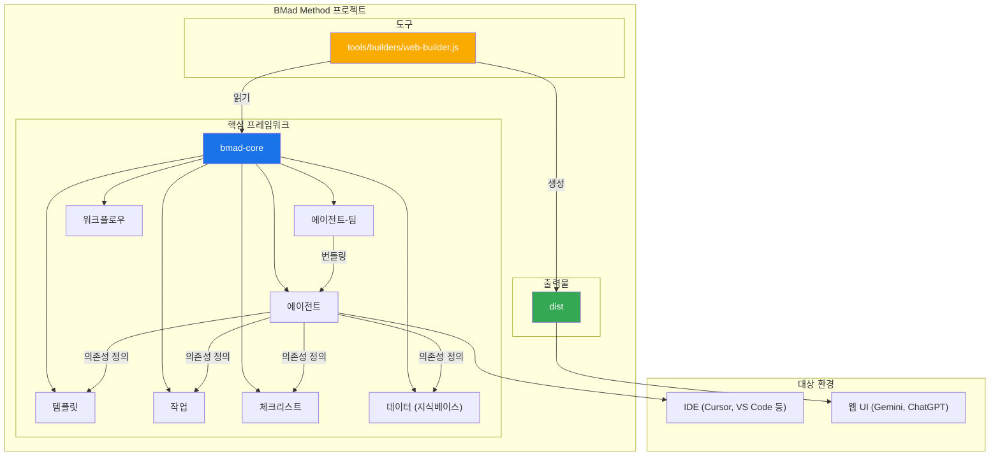
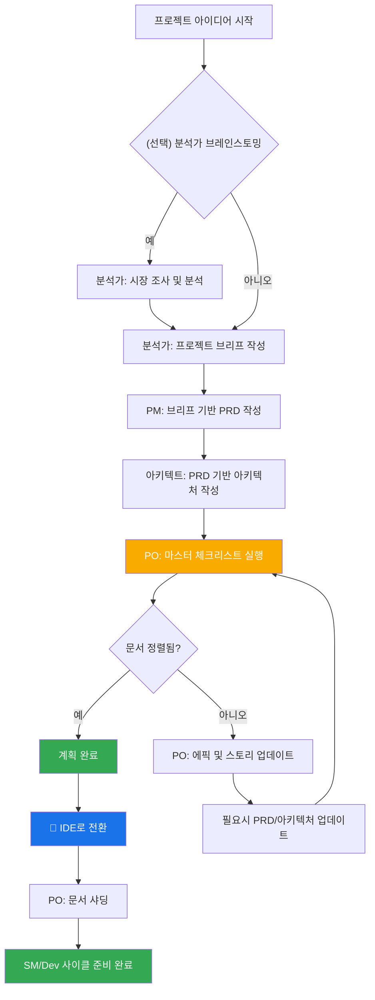
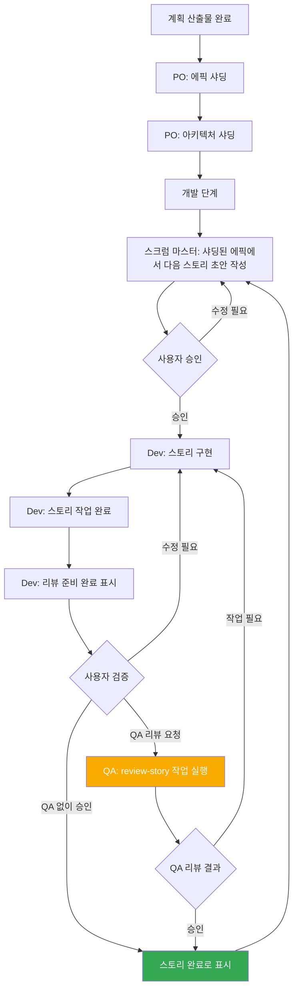

# BMad Method: 핵심 아키텍처

## 1. 개요

BMad Method는 애자일 에이전트 개발이든 완전히 다른 도메인으로의 확장이든 반복 가능한 유용한 워크플로우를 허용하는 에이전트 모드, 작업 및 템플릿을 제공하도록 설계되었습니다. 이 프로젝트의 핵심 목적은 사용자가 AI 에이전트(Gemini, Claude 또는 ChatGPT와 같은)를 가이드하여 복잡한 작업, 가이드된 토론 또는 기타 의미 있는 도메인별 플로우를 예측 가능하고 고품질 방식으로 수행할 수 있도록 하는 구조화되지만 유연한 프롬프트, 템플릿 및 워크플로우 세트를 제공하는 것입니다.

시스템의 핵심 모듈은 현재 현대 AI 에이전트 도구의 과제에 맞춘 전체 개발 라이프사이클을 촉진합니다:

1. **아이디어 및 계획**: 브레인스토밍, 시장 조사 및 프로젝트 브리프 작성.
2. **아키텍처 및 설계**: 시스템 아키텍처 및 UI/UX 명세 정의.
3. **개발 실행**: 스크럼 마스터(SM) 에이전트가 매우 구체적인 컨텍스트로 스토리를 작성하고 개발자(Dev) 에이전트가 한 번에 하나씩 구현하는 순환 워크플로우. 이 프로세스는 새로운(그린필드) 및 기존(브라운필드) 프로젝트 모두에서 작동합니다.

## 2. 시스템 아키텍처 다이어그램

전체 BMad-Method 생태계는 운영의 두뇌 역할을 하는 설치된 `bmad-core` 디렉토리를 중심으로 설계되었습니다. `tools` 디렉토리는 이 두뇌를 다양한 환경에 맞게 처리하고 패키징하는 수단을 제공합니다.

## 3. 핵심 구성 요소

`bmad-core` 디렉토리는 에이전트에게 능력을 부여하는 모든 정의와 리소스를 포함합니다.

### 3.1. 에이전트 (`bmad-core/agents/`)

- **목적**: 이것들은 시스템의 기본 구성 요소입니다. 각 마크다운 파일(예: `bmad-master.md`, `pm.md`, `dev.md`)은 단일 AI 에이전트의 페르소나, 능력 및 의존성을 정의합니다.
- **구조**: 에이전트 파일은 역할, 페르소나, 의존성 및 시작 지침을 지정하는 YAML 헤더를 포함합니다. 이러한 의존성은 에이전트가 사용할 수 있는 작업, 템플릿, 체크리스트 및 데이터 파일의 목록입니다.
- **시작 지침**: 에이전트는 코딩 표준, API 명세 또는 프로젝트 구조 문서와 같은 `docs/` 폴더에서 프로젝트별 문서를 로드하는 시작 시퀀스를 포함할 수 있습니다. 이는 활성화 시 즉시 프로젝트 컨텍스트를 제공합니다.
- **문서 통합**: 에이전트는 작업, 워크플로우 또는 시작 시퀀스의 일부로 프로젝트의 `docs/` 폴더에서 문서를 참조하고 로드할 수 있습니다. 사용자는 추가 컨텍스트를 제공하기 위해 문서를 채팅 인터페이스로 직접 드래그할 수도 있습니다.
- **예제**: `bmad-master` 에이전트는 의존성을 나열하며, 이는 빌드 도구에게 웹 번들에 포함할 파일을 알려주고 에이전트에게 자신의 능력을 알려줍니다.

### 3.2. 에이전트 팀 (`bmad-core/agent-teams/`)

- **목적**: 팀 파일(예: `team-all.yaml`)은 "풀스택 개발" 또는 "백엔드 전용"과 같은 특정 목적을 위해 함께 번들링되는 에이전트와 워크플로우의 컬렉션을 정의합니다. 이는 웹 UI 환경을 위한 더 크고 사전 패키지된 컨텍스트를 생성합니다.
- **구조**: 팀 파일은 포함할 에이전트를 나열합니다. 모든 에이전트를 포함하기 위해 `"*"`와 같은 와일드카드를 사용할 수 있습니다. 이를 통해 `team-all`과 같은 포괄적인 번들을 생성할 수 있습니다.

### 3.3. 워크플로우 (`bmad-core/workflows/`)

- **목적**: 워크플로우는 특정 프로젝트 유형에 대한 규정된 단계 시퀀스와 에이전트 상호작용을 정의하는 YAML 파일(예: `greenfield-fullstack.yaml`)입니다. 사용자와 `bmad-orchestrator` 에이전트를 위한 전략적 가이드 역할을 합니다.
- **구조**: 워크플로우는 복잡한 프로젝트와 단순한 프로젝트 모두에 대한 시퀀스를 정의하고, 각 단계에 관련된 에이전트, 그들이 생성하는 산출물, 그리고 한 단계에서 다음 단계로 이동하는 조건을 나열합니다. 시각화를 위해 Mermaid 다이어그램을 포함하는 경우가 많습니다.

### 3.4. 재사용 가능한 리소스 (`templates`, `tasks`, `checklists`, `data`)

- **목적**: 이 폴더들은 에이전트가 의존성에 따라 동적으로 로드하는 모듈식 구성 요소를 보관합니다.
  - **`templates/`**: PRD, 아키텍처 명세, 사용자 스토리와 같은 공통 문서를 위한 마크다운 템플릿을 포함합니다.
  - **`tasks/`**: "shard-doc" 또는 "create-next-story"와 같은 특정하고 반복 가능한 작업을 수행하기 위한 지침을 정의합니다.
  - **`checklists/`**: 제품 소유자(`po`) 또는 아키텍트와 같은 에이전트를 위한 품질 보증 체크리스트를 제공합니다.
  - **`data/`**: 핵심 지식 베이스(`bmad-kb.md`), 기술적 선호도(`technical-preferences.md`) 및 기타 핵심 데이터 파일을 포함합니다.

#### 3.4.1. 템플릿 처리 시스템

BMad의 핵심 아키텍처 원칙은 템플릿이 자체 포함되고 대화형이라는 것입니다 - 원하는 문서 출력과 사용자와 작업하는 데 필요한 LLM 지침을 모두 포함합니다. 이는 많은 경우 템플릿 자체가 모든 처리 로직을 포함하므로 문서 생성을 위한 별도의 작업이 필요하지 않음을 의미합니다.

BMad 프레임워크는 세 가지 핵심 구성 요소로 조율되는 정교한 템플릿 처리 시스템을 사용합니다:

- **`template-format.md`** (`bmad-core/utils/`): 모든 BMad 템플릿에서 사용되는 기본 마크업 언어를 정의합니다. 이 명세는 변수 치환(`{{placeholders}}`), AI 전용 처리 지시문(`[[LLM: instructions]]`) 및 조건부 로직 블록에 대한 구문 규칙을 설정합니다. 템플릿은 시스템 전반에서 일관된 처리를 보장하기 위해 이 형식을 따릅니다.

- **`create-doc.md`** (`bmad-core/tasks/`): 전체 문서 생성 워크플로우를 관리하는 오케스트레이션 엔진 역할을 합니다. 이 작업은 템플릿 선택을 조정하고, 사용자 상호작용 모드(점진적 vs. 신속 생성)를 관리하며, 템플릿 형식 처리 규칙을 시행하고, 검증을 처리합니다. 사용자와 템플릿 시스템 간의 주요 인터페이스 역할을 합니다.

- **`advanced-elicitation.md`** (`bmad-core/tasks/`): 템플릿 내 `[[LLM: instructions]]` 블록을 통해 임베드할 수 있는 대화형 개선 레이어를 제공합니다. 이 컴포넌트는 10가지 구조화된 브레인스토밍 액션, 섹션별 리뷰 기능, 반복적 개선 워크플로우를 통해 콘텐츠 품질을 높입니다.

시스템은 관심사의 명확한 분리를 유지합니다: 템플릿 마크업은 AI 에이전트에 의해 내부적으로 처리되며 사용자에게 노출되지 않고, 템플릿 내에 내장된 지능을 통해 고도화된 AI 처리 기능을 제공합니다.

#### 3.4.2. 기술적 선호도 시스템

BMad는 `bmad-core/data/`의 `technical-preferences.md` 파일을 통해 개인화 레이어를 제공합니다. 이 파일은 모든 프로젝트에서 에이전트의 행동에 영향을 주는 지속적인 기술 프로필 역할을 합니다.

**목적 및 장점:**

- **일관성**: 모든 에이전트가 동일한 기술적 선호도를 참조하도록 보장
- **효율성**: 선호 기술을 반복적으로 지정할 필요 없음
- **개인화**: 에이전트가 사용자 선호에 맞는 추천 제공
- **학습**: 프로젝트에서 얻은 교훈과 진화하는 선호도를 기록

**내용 구조:**
이 파일에는 일반적으로 선호 기술 스택, 설계 패턴, 외부 서비스, 코딩 표준, 피해야 할 안티패턴 등이 포함됩니다. 에이전트는 계획 및 개발 중 자동으로 이 파일을 참조하여 상황에 맞는 제안을 제공합니다.

**통합 포인트:**

- 템플릿은 문서 생성 중 기술적 선호도를 참조할 수 있음
- 에이전트는 프로젝트 요구에 맞는 기술을 추천함
- 선호도가 프로젝트 요구에 맞지 않을 경우, 에이전트가 대안을 설명함
- 웹 번들은 일관된 동작을 위해 선호도 내용을 포함할 수 있음

**시간에 따른 진화:**
사용자는 프로젝트에서 얻은 발견을 지속적으로 이 파일에 추가하여, 긍정적 선호도와 피해야 할 기술 모두를 기록함으로써 시간이 지남에 따라 에이전트 추천 품질이 향상되는 개인화된 지식 베이스를 구축할 수 있습니다.

## 4. The Build & Delivery Process

프레임워크는 두 가지 주요 환경(로컬 IDE와 웹 기반 AI 챗 인터페이스)을 위해 설계되었습니다. `web-builder.js` 스크립트가 웹 환경 지원의 핵심입니다.

### 4.1. 웹 빌더 (`tools/builders/web-builder.js`)

- **목적**: 이 Node.js 스크립트는 `dist`에 있는 `.txt` 번들을 생성합니다.
- **프로세스**:
    1. **의존성 해석**: 에이전트 또는 팀에 대해 정의 파일을 읽습니다.
    2. 에이전트/팀이 필요로 하는 모든 의존 리소스(작업, 템플릿 등)를 재귀적으로 찾습니다.
    3. **콘텐츠 번들링**: 모든 파일의 내용을 읽어, 각 섹션의 원본 파일 경로를 명확히 구분하여 하나의 큰 텍스트 파일로 합칩니다.
    4. **번들 출력**: 최종 `.txt` 파일을 `dist` 디렉토리에 저장하여 웹 UI에 업로드할 준비를 합니다.

### 4.2. 환경별 사용법

- **IDE용**: 사용자는 `bmad-core/agents/`의 마크다운 파일을 통해 에이전트와 직접 상호작용합니다. IDE 통합(Cursor, Claude Code 등)은 이 에이전트들을 호출하는 방법을 알고 있습니다.
- **웹 UI용**: 사용자는 `dist`에서 미리 빌드된 번들을 업로드합니다. 이 단일 파일이 AI에게 전체 팀과 필요한 모든 도구 및 지식의 컨텍스트를 제공합니다.

## 5. BMad Workflows

### 5.1. 계획 워크플로우

개발 시작 전에 BMad는 성공적인 프로젝트 실행의 기반을 마련하는 구조화된 계획 워크플로우를 따릅니다:

**주요 계획 단계:**

1. **선택적 분석**: 분석가가 시장 조사 및 경쟁 분석 수행
2. **프로젝트 브리프**: 분석가 또는 사용자가 작성하는 기반 문서
3. **PRD 작성**: PM이 브리프를 포괄적 제품 요구사항으로 변환
4. **아키텍처 설계**: 아키텍트가 PRD 기반 기술적 토대 작성
5. **검증 및 정렬**: PO가 모든 문서의 일관성과 완성도 확인
6. **정제**: 필요시 에픽, 스토리, 문서 업데이트
7. **환경 전환**: 개발 워크플로우를 위해 웹 UI에서 IDE로 전환
8. **문서 준비**: PO가 대형 문서를 개발용으로 샤딩

**워크플로우 오케스트레이션**: `bmad-orchestrator` 에이전트가 이 워크플로우 정의를 사용해 전체 과정을 안내하며, 계획(웹 UI)과 개발(IDE) 단계 간의 적절한 전환을 보장합니다.

### 5.2. The Core Development Cycle

초기 계획 및 아키텍처 단계가 완료되면, 프로젝트는 `bmad-kb.md`에 상세히 설명된 순환 개발 워크플로우로 이동합니다. 이를 통해 꾸준하고 순차적이며 품질이 관리된 구현 프로세스를 보장합니다.

이 사이클은 스크럼 마스터, 개발자, 그리고 선택적으로 QA 에이전트가 함께 작업하며 계속됩니다. QA 에이전트는 `review-story` 작업을 통해 시니어 개발자 리뷰 기능을 제공하며, 코드 리팩토링, 품질 개선, 지식 이전을 지원합니다. 이를 통해 개발 속도를 유지하면서도 높은 코드 품질을 보장합니다.
