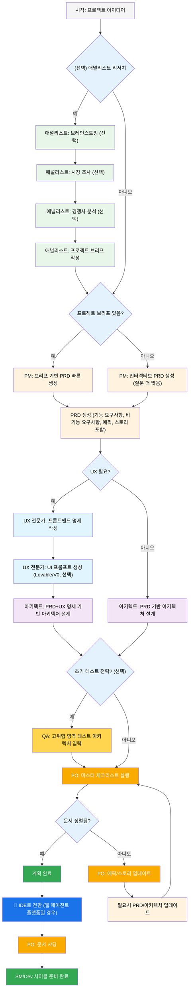
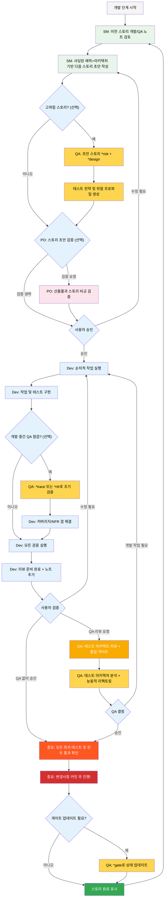

# BMad Method — 사용자 가이드

이 가이드는 애자일 AI 주도 계획 및 개발을 위한 BMad Method를 이해하고 효과적으로 사용하는 데 도움이 될 것입니다.

## BMad 계획 및 실행 워크플로우

먼저, 전체 표준 그린필드(신규 프로젝트) 계획 + 실행 워크플로우입니다. 브라운필드(기존 프로젝트)는 매우 유사하지만, 브라운필드 프로젝트를 시작하기 전에 이 그린필드 흐름을 먼저 이해하는 것이 좋습니다. BMad Method는 새 프로젝트 폴더의 루트에 설치되어야 합니다. 계획 단계는 강력한 웹 에이전트로 선택적으로 수행할 수 있으며, 일부 에이전트 도구에서 자체 API 키나 크레딧을 제공할 때 소요되는 비용의 일부로 더 높은 품질의 결과를 얻을 수 있습니다. 계획을 위해서는 강력한 사고 모델과 더 큰 컨텍스트, 그리고 에이전트와의 파트너십이 최상의 결과를 가져옵니다.

기존 프로젝트(브라운필드 프로젝트)에서 BMad Method를 사용할 예정이라면, **[브라운필드에서 작업하기](./working-in-the-brownfield.md)**를 참고하세요.

아래 다이어그램이 렌더링되지 않으면, VSCode에 Markdown All in One과 Markdown Preview Mermaid Support 확장 프로그램을 설치하세요. 탭에서 우클릭 후 Open Preview 옵션을 사용하거나 IDE 문서를 참고하세요.

### 계획 워크플로우 (웹 UI 또는 강력한 IDE 에이전트)

개발 시작 전, BMad는 웹 UI에서 수행되는 구조화된 계획 워크플로우를 따릅니다:



#### 웹 UI에서 IDE로의 전환

**중요한 전환점**: PO가 문서 정렬을 확인하면, 개발 워크플로우를 시작하기 위해 웹 UI에서 IDE로 전환해야 합니다:

1. **프로젝트에 문서 복사**: `docs/prd.md`와 `docs/architecture.md`가 프로젝트의 docs 폴더(또는 설치 중 지정할 수 있는 사용자 정의 위치)에 있는지 확인
2. **IDE로 전환**: 선호하는 에이전트 IDE에서 프로젝트 열기
3. **문서 샤딩**: PO 에이전트를 사용하여 PRD를 샤딩한 다음 아키텍처를 샤딩
4. **개발 시작**: 이어지는 핵심 개발 사이클 시작

#### 계획 산출물 (표준 경로)

```text
PRD              → docs/prd.md
Architecture     → docs/architecture.md
Sharded Epics    → docs/epics/
Sharded Stories  → docs/stories/
QA Assessments   → docs/qa/assessments/
QA Gates         → docs/qa/gates/
```

### 핵심 개발 사이클 (IDE)

계획이 완료되고 문서가 샤딩되면, BMad는 구조화된 개발 워크플로우를 따릅니다:



## Prerequisites

BMad Method를 설치하기 전에 다음을 준비하세요:

- **Node.js** 18 이상, **npm** 9 이상
- **Git** 설치 및 설정
- **(선택)** VS Code에서 "Markdown All in One"과 "Markdown Preview Mermaid Support" 확장 프로그램 설치

## Installation

### 선택 사항

웹에서 Claude(Sonnet 4 또는 Opus), Gemini Gem(2.5 Pro), Custom GPT 등으로 계획을 진행하려면:

1. `dist/teams/`로 이동
2. `team-fullstack.txt` 복사
3. Gemini Gem 또는 CustomGPT 새로 생성
4. 파일 업로드 시 "운영 지침이 첨부되어 있으니 반드시 지시대로 캐릭터를 유지하세요"라고 안내
5. `/help` 입력 시 사용 가능한 명령어 확인

### IDE 프로젝트 설정

```bash
# 대화형 설치(권장)
npx bmad-method install
```

## Special Agents

BMad에는 두 종류의 에이전트가 있습니다. 앞으로는 하나의 BMad-Master로 통합될 예정입니다.

### BMad-Master

이 에이전트는 실제 스토리 구현을 제외한 모든 작업과 명령을 수행할 수 있습니다. 또한 웹에서 BMad Method를 설명하거나 지식 베이스를 활용해 프로세스에 대해 안내할 수 있습니다.

개발 에이전트 외에 여러 에이전트를 번갈아 쓰기 번거롭다면 이 에이전트를 사용하세요. 단, 컨텍스트가 커질수록 성능이 저하되므로, 대화를 압축하고 새로운 대화를 시작하도록 자주 지시하는 것이 중요합니다. 특히 각 스토리 구현 후마다 대화 압축을 권장합니다.

### BMad-Orchestrator

이 에이전트는 IDE에서는 사용하지 마세요. 많은 컨텍스트를 활용하는 무거운 특수 목적 에이전트로, 웹 번들 내 팀을 지원하기 위해 존재합니다. 웹 번들을 사용할 경우 BMad Orchestrator가 안내합니다.

### How Agents Work

#### 의존성 시스템

각 에이전트는 YAML 섹션에 의존성을 정의합니다:

```yaml
dependencies:
  templates:
    - prd-template.md
    - user-story-template.md
  tasks:
    - create-doc.md
    - shard-doc.md
  data:
    - bmad-kb.md
```

**핵심 포인트:**

- 에이전트는 필요한 리소스만 로드(가벼운 컨텍스트)
- 번들링 시 의존성 자동 해결
- 리소스는 에이전트 간 공유되어 일관성 유지

#### Agent Interaction

**IDE에서:**

```bash
# Cursor, Windsurf 등 일부 IDE는 '@' 기호로 명령을 입력합니다
@pm 작업 관리 앱용 PRD 생성
@architect 시스템 아키텍처 설계
@dev 사용자 인증 구현

# Claude Code 등 일부 IDE는 슬래시 명령을 사용합니다
/pm 사용자 스토리 생성
/dev 로그인 버그 수정
```

#### Interactive Modes

- **점진적 모드**: 사용자 입력에 따라 단계별 진행
- **YOLO 모드**: 최소한의 상호작용으로 빠른 생성

## IDE Integration

### IDE 활용 베스트 프랙티스

- **컨텍스트 관리**: 필요한 파일만 컨텍스트에 포함, 파일은 최대한 간결하게 유지
- **에이전트 선택**: 작업에 맞는 에이전트 사용
- **반복적 개발**: 작은 단위의 집중 작업으로 진행
- **파일 구조 관리**: 프로젝트 구조를 깔끔하게 유지
- **자주 커밋**: 작업을 자주 저장

## The Test Architect (QA Agent)

### 개요

BMad의 QA 에이전트는 단순한 "시니어 개발자 리뷰어"가 아니라, 테스트 전략, 품질 게이트, 위험 기반 테스트에 깊은 전문성을 가진 **테스트 아키텍트**입니다. Quinn이라는 이름을 가진 이 에이전트는 품질 관련 조언을 제공하며, 안전할 경우 코드 품질을 직접 개선하기도 합니다.

#### Quick Start (Essential Commands)

```bash
@qa *risk {story}       # 개발 전 위험 평가
@qa *design {story}     # 테스트 전략 생성
@qa *trace {story}      # 개발 중 테스트 커버리지 검증
@qa *nfr {story}        # 품질 속성 확인
@qa *review {story}     # 전체 평가 → 게이트 작성
```

#### Command Aliases (Test Architect)

문서에서는 편의를 위해 명령을 축약형으로 사용합니다. 두 스타일 모두 유효합니다:

```text
*risk    → *risk-profile
*design  → *test-design
*nfr     → *nfr-assess
*trace   → *trace-requirements (또는 *trace)
*review  → *review
*gate    → *gate
```

### Core Capabilities

#### 1. 위험 프로파일링(`*risk`)

**언제:** 스토리 초안 후, 개발 시작 전(가장 빠른介入 시점)

구현 위험을 식별하고 평가합니다:

- **카테고리**: 기술, 보안, 성능, 데이터, 비즈니스, 운영
- **점수 산정**: 확률 × 영향 분석(1~9점)
- **완화**: 각 위험별 구체적 대응 전략
- **게이트 영향**: 위험 ≥9는 FAIL, ≥6은 CONCERNS(자세한 규칙은 `tasks/risk-profile.md` 참고)

#### 2. Test Design (`*design`)

**언제:** 스토리 초안 후, 개발 시작 전(테스트 작성 가이드)

포괄적 테스트 전략을 생성합니다:

- 각 승인 기준별 테스트 시나리오
- 적절한 테스트 레벨 권장(unit, integration, E2E)
- 위험 기반 우선순위(P0/P1/P2)
- 테스트 데이터 요구사항 및 목 전략
- CI/CD 통합 실행 전략

**예시 출력:**

```yaml
test_summary:
  total: 24
  by_level:
    unit: 15
    integration: 7
    e2e: 2
  by_priority:
    P0: 8 # 반드시 필요 - 치명적 위험과 연결
    P1: 10 # 있으면 좋음 - 중간 위험
    P2: 6 # 선택 사항 - 낮은 위험
```

#### 3. Requirements Tracing (`*trace`)

**언제:** 개발 중(중간 점검)

요구사항과 테스트 커버리지를 매핑합니다:

- 각 승인 기준을 검증하는 테스트 문서화
- Given-When-Then 형식으로 명확성 확보(문서용, BDD 코드 아님)
- 커버리지 누락 및 심각도 평가
- 감사용 추적 매트릭스 생성

#### 4. NFR Assessment (`*nfr`)

**언제:** 개발 중 또는 초기 리뷰(품질 속성 검증)

비기능 요구사항을 검증합니다:

- **핵심 4요소**: 보안, 성능, 신뢰성, 유지보수성
- **근거 기반**: 실제 구현 증거 확인
- **게이트 연동**: NFR 실패는 품질 게이트에 직접 영향

#### 5. Comprehensive Test Architecture Review (`*review`)

**언제:** 개발 완료 후, 스토리가 "리뷰 준비 완료"로 표시되면

`@qa *review {story}`를 실행하면 Quinn이 다음을 수행합니다:

- **요구사항 추적성**: 모든 승인 기준을 검증 테스트에 매핑
- **테스트 레벨 분석**: 단위/통합/E2E 테스트 적정성 확인
- **커버리지 평가**: 누락 및 중복 테스트 식별
- **능동적 리팩토링**: 안전할 경우 코드 품질 직접 개선
- **품질 게이트 결정**: PASS/CONCERNS/FAIL 상태 부여

#### 6. Quality Gates (`*gate`)

**언제:** 리뷰 후 수정 또는 게이트 상태 업데이트 필요 시

품질 게이트 결정을 관리합니다:

- **결정적 규칙**: PASS/CONCERNS/FAIL 기준 명확
- **병렬 권한**: QA가 `docs/qa/gates/` 내 게이트 파일 소유
- **자문 성격**: 권고만 제공, 차단하지 않음
- **면제 지원**: 필요시 수용된 위험 문서화

**참고:** 게이트는 자문용이며, 팀이 품질 기준을 선택합니다. WAIVED는 사유, 승인자, 만료일이 필요합니다. 스키마는 `templates/qa-gate-tmpl.yaml`, 규칙은 `tasks/review-story.md`, 점수 산정은 `tasks/risk-profile.md` 참고.

### Working with the Test Architect

#### BMad 워크플로우와의 통합

테스트 아키텍트는 개발 라이프사이클 전반에 걸쳐 가치를 제공합니다. 각 기능을 언제, 어떻게 활용할지 아래 표를 참고하세요:

| **단계**            | **명령어** | **사용 시점**                | **가치**                      | **출력**                                                        |
| ------------------ | ---------- | ---------------------------- | ----------------------------- | --------------------------------------------------------------- |
| **스토리 초안**     | `*risk`    | SM이 스토리 초안 작성 후      | 위험 조기 식별                | `docs/qa/assessments/{epic}.{story}-risk-{YYYYMMDD}.md`         |
|                    | `*design`  | 위험 평가 후                  | 테스트 전략 가이드            | `docs/qa/assessments/{epic}.{story}-test-design-{YYYYMMDD}.md`  |
| **개발 중**         | `*trace`   | 구현 중간 점검                | 테스트 커버리지 검증          | `docs/qa/assessments/{epic}.{story}-trace-{YYYYMMDD}.md`        |
|                    | `*nfr`     | 기능 개발 중                  | 품질 이슈 조기 발견           | `docs/qa/assessments/{epic}.{story}-nfr-{YYYYMMDD}.md`          |
| **리뷰**           | `*review`  | 스토리 완료 후                | 전체 품질 평가                | 스토리 내 QA 결과 + 게이트 파일                                 |
| **리뷰 후**        | `*gate`    | 이슈 수정 후                  | 품질 결정 업데이트            | 업데이트된 `docs/qa/gates/{epic}.{story}-{slug}.yml`            |

#### Example Commands

```bash
# 계획 단계 - 개발 시작 전 실행
@qa *risk {draft-story}     # 어떤 위험이 있을까?
@qa *design {draft-story}   # 어떤 테스트를 작성해야 할까?

# 개발 단계 - 코딩 중 실행
@qa *trace {story}          # 모든 테스트가 작성됐나?
@qa *nfr {story}            # 품질 기준을 충족하나?

# 리뷰 단계 - 개발 완료 시 실행
@qa *review {story}         # 포괄적 평가 + 리팩토링

# 리뷰 후 - 이슈 수정 후 실행
@qa *gate {story}           # 게이트 상태 업데이트
```

### Quality Standards Enforced

Quinn은 다음 테스트 품질 원칙을 준수하도록 보장합니다:

- **불안정 테스트 금지**: 올바른 비동기 처리로 신뢰성 확보
- **강제 대기 금지**: 동적 대기 전략만 사용
- **무상태 & 병렬 안전**: 테스트는 독립적으로 실행
- **셀프 클린**: 테스트가 자체적으로 테스트 데이터 관리
- **적절한 테스트 레벨**: 로직은 단위, 상호작용은 통합, 여정은 E2E
- **명확한 단언문**: 단언문은 테스트 내에만 작성

### Gate Status Meanings

- **PASS**: 모든 핵심 요구사항 충족, 차단 이슈 없음
- **CONCERNS**: 비핵심 이슈 발견, 팀 리뷰 권장
- **FAIL**: 반드시 해결해야 할 치명적 이슈(보안 위험, P0 테스트 누락 등)
- **WAIVED**: 이슈를 인정하고 팀이 명시적으로 수용

### Special Situations

**고위험 스토리:**

- 개발 시작 전 반드시 `*risk`와 `*design` 실행
- 개발 중간에 `*trace`, `*nfr` 체크포인트 고려

**복잡한 통합:**

- 개발 중 `*trace`로 모든 통합 포인트 테스트
- 이후 `*nfr`로 통합 성능 검증

**성능 중요:**

- 개발 중 `*nfr`을 조기에 자주 실행
- 리뷰 때까지 기다리지 말고 성능 이슈 조기 발견

**브라운필드/레거시 코드:**

- 회귀 위험 식별을 위해 `*risk`부터 시작
- `*review`에서 하위 호환성에 추가 집중

### Best Practices

- **초기 참여**: 스토리 초안 단계에서 `*design`, `*risk` 실행
- **위험 기반 집중**: 위험 점수가 테스트 우선순위 결정
- **반복적 개선**: QA 피드백으로 다음 스토리 품질 향상
- **게이트 투명성**: 게이트 결정 팀과 공유
- **지속적 학습**: QA가 패턴을 문서화해 팀 지식 공유
- **브라운필드 주의**: 기존 시스템 회귀 위험에 추가 주의

### Output Paths Reference

테스트 아키텍트 출력 경로 빠른 참고:

```text
*risk-profile  → docs/qa/assessments/{epic}.{story}-risk-{YYYYMMDD}.md
*test-design   → docs/qa/assessments/{epic}.{story}-test-design-{YYYYMMDD}.md
*trace         → docs/qa/assessments/{epic}.{story}-trace-{YYYYMMDD}.md
*nfr-assess    → docs/qa/assessments/{epic}.{story}-nfr-{YYYYMMDD}.md
*review        → 스토리 내 QA 결과 섹션 + 게이트 파일 참조
*gate          → docs/qa/gates/{epic}.{story}-{slug}.yml
```

## Technical Preferences System

BMad는 `.bmad-core/data/`의 `technical-preferences.md` 파일을 통해 개인화 시스템을 제공합니다. 이 파일에 디자인 패턴, 기술 선택 등 원하는 내용을 작성하면 PM과 아키텍트가 추천에 반영할 수 있습니다.

### 웹 번들에서 활용

웹 번들을 만들거나 AI 플랫폼에 업로드할 때, `technical-preferences.md` 내용을 포함하면 에이전트가 대화 시작부터 사용자의 선호를 반영할 수 있습니다.

## Core Configuration

`bmad-core/core-config.yaml` 파일은 다양한 프로젝트 구조에서 BMad가 원활하게 동작하도록 하는 핵심 설정 파일입니다. 앞으로 더 많은 옵션이 추가될 예정이며, 현재 가장 중요한 것은 yaml 내 devLoadAlwaysFiles 리스트입니다.

### 개발자 컨텍스트 파일

dev 에이전트가 항상 로드해야 하는 파일을 지정합니다:

```yaml
devLoadAlwaysFiles:
  - docs/architecture/coding-standards.md
  - docs/architecture/tech-stack.md
  - docs/architecture/project-structure.md
```

아키텍처 샤딩 후 이 문서들이 존재하는지, 최대한 간결한지, dev 에이전트가 반드시 로드해야 할 정보만 포함하는지 확인하세요. 이 규칙을 에이전트가 따릅니다.

프로젝트가 커지고 코드 패턴이 일관성을 갖추면, 코딩 표준은 에이전트가 실제로 필요로 하는 규칙만 남기도록 줄여야 합니다. 에이전트는 파일 내 주변 코드를 참고해 현재 작업에 필요한 코딩 표준을 추론합니다.

## Getting Help

- **디스코드 커뮤니티**: [디스코드 참여](https://discord.gg/gk8jAdXWmj)
- **GitHub 이슈**: [버그 신고](https://github.com/bmadcode/bmad-method/issues)
- **문서**: [문서 보기](https://github.com/bmadcode/bmad-method/docs)
- **유튜브**: [BMadCode 채널](https://www.youtube.com/@BMadCode)

## Conclusion

기억하세요: BMad는 여러분의 전문성을 대체하는 것이 아니라 개발 프로세스를 강화하기 위해 설계되었습니다. 프로젝트를 빠르게 진행하는 강력한 도구로 활용하되, 설계 결정과 구현 세부사항에 대한 주도권은 항상 여러분에게 있습니다.
